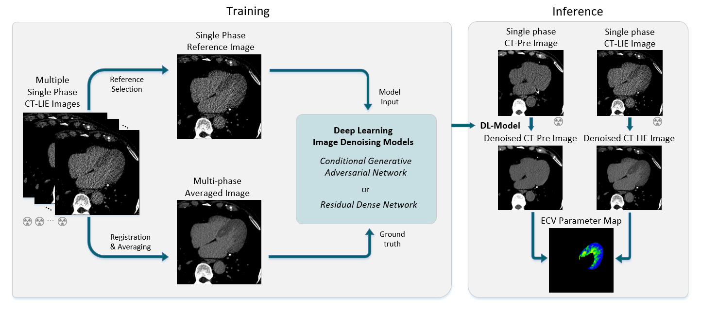

# Image-Denoising-for-ECV-Quantification

This repository is the official implementation of Deep learning model for low dose CT late iodine enhancement imaging and extracellular volume quantification.

In this work, we compared two models trained with distinct structures in the task of denoising the image of a CT late iodine enhancement, namely Residual Dense Network (RDN) and conditional Generative Adverseral Network (cGAN).



## Data Preparation

Before training the model, you should convert your volumetric data into NIFTI (with .nii or .nii.gz extend) and ensure that they structure in the directory structure illustrated below

```
└── root_dir
├── series_1_dir
│   ├── Delay_01.nii.gz
│   ├── ...
│   ├── Delay_avg.nii.gz
├── series_2_dir
│   ├── ...
│   ...
```

## cGAN - conditinal Generative Adversarial Network

In this work, we used PatchGAN with cGAN + L1 objective function which is originally proposed in this work:

Image-to-Image Translation with Conditional Adversarial Networks. [Phillip Isola](https://people.eecs.berkeley.edu/~isola), [Jun-Yan Zhu](https://www.cs.cmu.edu/~junyanz/), [Tinghui Zhou](https://people.eecs.berkeley.edu/~tinghuiz), [Alexei A. Efros](https://people.eecs.berkeley.edu/~efros). In CVPR 2017. [[Bibtex]](https://www.cs.cmu.edu/~junyanz/projects/pix2pix/pix2pix.bib)

[Paper](https://arxiv.org/pdf/1611.07004.pdf) |[ Code](https://github.com/junyanz/pytorch-CycleGAN-and-pix2pix)

To train the model, you can initalize the training process by running the line below in your terminal

```shell
python cGAN/train.py --dataroot PATH_TO_IMAGE
```

Training configurations of the model evaluated in our paper is set as default.

## RDN - Residual Dense Network

The second model evaluated in our paper is a Residual Dense Network (RDN) model used in denoising cardiac CT, which is adapted from the implementation in this work:

Deep Learning–based Post Hoc CT Denoising for Myocardial Delayed Enhancement. Tatsuya Nishii, Takuma Kobayashi, Hironori Tanaka, Akiyuki Kotoku, Yasutoshi Ohta, Yoshiaki Morita, Kensuke Umehara, Junko Ota, Hiroki Horinouchi, Takayuki Ishida and Tetsuya Fukuda. In Radiology 2022. [[Bibtex]](https://pubs.rsna.org/action/showCitFormats?doi=10.1148%2Fradiol.220189)

[Paper](https://pubs.rsna.org/doi/10.1148/radiol.220189) | [Code](https://github.com/tkobayashi6/RDN-for-Denoising-in-CardiacCT)

The original paper and code of RDN can be found in following links:

[Paper](https://ieeexplore.ieee.org/document/8964437) | [Code](https://github.com/yulunzhang/RDN)

Before training, you should first prepare a CSV file containing four columns: series, LQ, HQ, slice, 

where 

series - the series uid of corresponding volumetric data

LQ - path to the low quality (high noise level) data

HQ - path to the high quality (low noise level) data

slice - slice index of the 2D image to be extracted in the volumetric data


To initalize the training process, you can run following line in your terminal

```
python RDN/train.py
```

Again, default configurations were set to reproduce the model evalutated in our paper. Feel free to change try any modifications in configs during training.

## Data Availability

The data underlying this article cannot be shared publicly due to for the privacy of individuals that participated in the study.

## Citations

```
@article{doi:10.1148/radiol.220189,
author = {Nishii, Tatsuya and Kobayashi, Takuma and Tanaka, Hironori and Kotoku, Akiyuki and Ohta, Yasutoshi and Morita, Yoshiaki and Umehara, Kensuke and Ota, Junko and Horinouchi, Hiroki and Ishida, Takayuki and Fukuda, Tetsuya},
title = {Deep Learning–based Post Hoc CT Denoising for Myocardial Delayed Enhancement},
journal = {Radiology},
volume = {305},
number = {1},
pages = {82-91},
year = {2022},
}

@inproceedings{isola2017image,
  title={Image-to-Image Translation with Conditional Adversarial Networks},
  author={Isola, Phillip and Zhu, Jun-Yan and Zhou, Tinghui and Efros, Alexei A},
  booktitle={Computer Vision and Pattern Recognition (CVPR), 2017 IEEE Conference on},
  year={2017}
}
```
